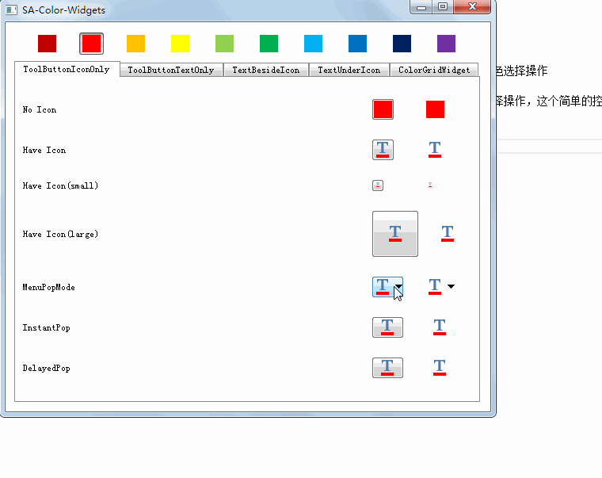
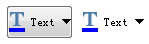
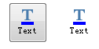
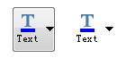
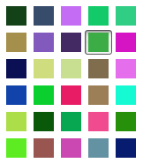
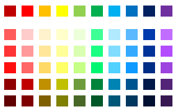
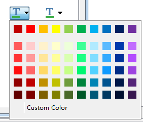

# 说明

颜色操作组件主要是为工业软件的颜色操作过程提供便利的封装，主要提供了颜色选择ToolButton，ColorGrid，实现了类似Office的颜色选择操作

颜色相关的操作有很多开源的封装，例如有ctk的`ctkColorPickerButton`，有`kColorPicker`，但这些都无法实现像Office的颜色选择操作，这个简单的控件就是为了实现类似Office的颜色操作方式

# 效果

## `SAColorToolButton`

实现颜色设置的工具按钮，在原来ToolButton的基础上，加上了设置颜色的接口，并会把颜色显示到按钮上，同时也可以设置图标，让颜色和图标同时显示

`Qt::ToolButtonIconOnly`模式

没有设置图标：

有设置图标：

有菜单：

`Qt::ToolButtonTextOnly`模式

`Qt::ToolButtonTextBesideIcon`模式

`Qt::ToolButtonTextUnderIcon`模式:

## `SAColorGridWidget`

这是一个颜色块，用于给用户进行颜色选择，效果如下：

## `SAColorPaletteGridWidget`

这是一个颜色选择板，有一行标准颜色（最顶上的一行），下面会根据标准颜色进行加亮80%，60%，40%，加暗25%，50%的色块（可以设置比例因子），效果如下：

## `SAColorMenu`

这是一个颜色选择菜单，可以实现类似office的颜色选择功能

